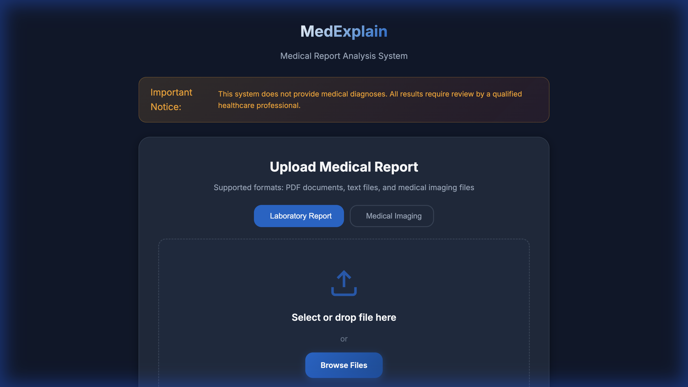
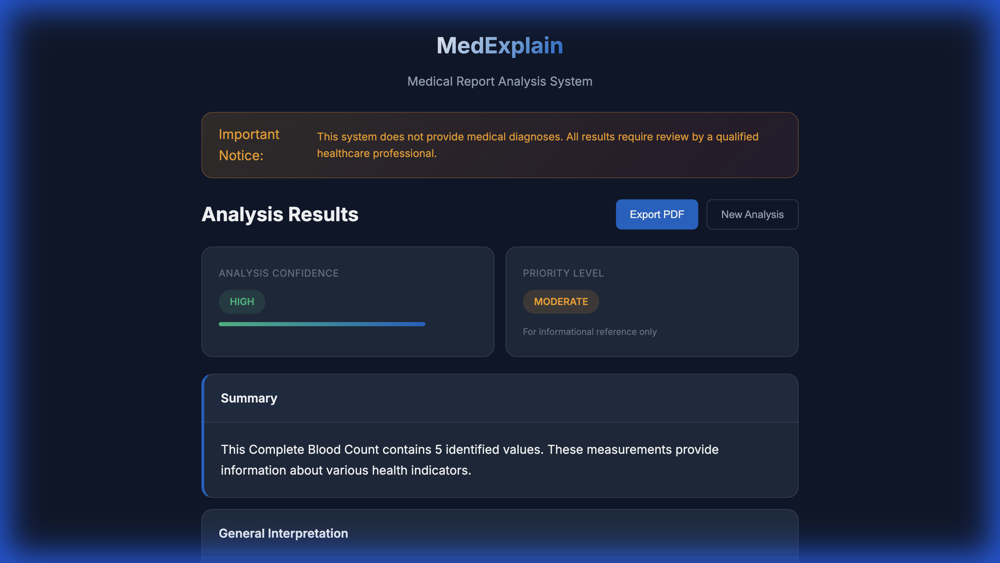

<div align="center">

# MedExplain

### Healthcare Report Analysis & Interpretation System

[](https://python.org)
[](https://fastapi.tiangolo.com)
[](https://docker.com)
[](LICENSE)

*An enterprise-grade medical report analysis system designed to help patients understand their laboratory results through automated interpretation, while maintaining strict compliance with healthcare communication standards.*

[Features](#features) • [Architecture](#architecture) • [Installation](#installation) • [API Reference](#api-reference) • [Screenshots](#screenshots)

---

</div>

## Overview

**MedExplain** is a production-ready healthcare information system that processes medical laboratory reports and provides structured, patient-friendly interpretations. Built with a focus on **safety**, **compliance**, and **scalability**, it demonstrates modern software engineering practices suitable for healthcare environments.

> **Important**: This system is designed for educational and informational purposes only. It does not provide medical diagnoses. All outputs require review by qualified healthcare professionals.

---

## Features

### Core Capabilities

| Feature | Description |
|---------|-------------|
| **Document Processing** | Extracts and analyzes content from PDF and text-based medical reports |
| **Value Recognition** | Identifies laboratory values (glucose, cholesterol, CBC, metabolic panels, etc.) |
| **Intelligent Interpretation** | Rule-based analysis with optional LLM enhancement via Google Gemini API |
| **Medical Imaging Pipeline** | Processing infrastructure for radiographic images |
| **PDF Report Generation** | Professional export functionality with proper medical disclaimers |
| **Real-time API** | RESTful endpoints for seamless integration with healthcare systems |

### Safety & Compliance

- **Mandatory Disclaimers**: Every output includes legally-compliant medical notices
- **Language Filtering**: Automatic detection and modification of diagnostic or alarming terminology
- **Confidence Scoring**: Transparent reliability indicators for all interpretations
- **Audit Logging**: Structured JSON logging for compliance and debugging
- **Rate Limiting**: Built-in protection against API abuse

---

## Architecture

```
┌─────────────────────────────────────────────────────────────────────┐
│                           CLIENT LAYER                               │
│  ┌─────────────────┐  ┌─────────────────┐  ┌─────────────────┐     │
│  │   Web Interface  │  │   REST API      │  │   PDF Export    │     │
│  │   (HTML/JS/CSS)  │  │   Consumers     │  │   Service       │     │
│  └────────┬────────┘  └────────┬────────┘  └────────┬────────┘     │
└───────────┼────────────────────┼────────────────────┼───────────────┘
            │                    │                    │
            ▼                    ▼                    ▼
┌─────────────────────────────────────────────────────────────────────┐
│                           API GATEWAY                                │
│  ┌─────────────────────────────────────────────────────────────┐   │
│  │  FastAPI Application                                         │   │
│  │  • Request Validation  • CORS Handling  • Rate Limiting     │   │
│  │  • Error Handling      • Logging        • Multi-tenant      │   │
│  └─────────────────────────────────────────────────────────────┘   │
└─────────────────────────────────────────────────────────────────────┘
            │
            ▼
┌─────────────────────────────────────────────────────────────────────┐
│                        SERVICE LAYER                                 │
│  ┌──────────────┐  ┌──────────────┐  ┌──────────────────────────┐  │
│  │   Report     │  │   Safety     │  │   Report Generator       │  │
│  │   Analyzer   │  │   Checker    │  │   (Jinja2 + WeasyPrint)  │  │
│  └──────┬───────┘  └──────┬───────┘  └──────────────────────────┘  │
└─────────┼─────────────────┼─────────────────────────────────────────┘
          │                 │
          ▼                 ▼
┌─────────────────────────────────────────────────────────────────────┐
│                         CORE LAYER                                   │
│  ┌──────────────┐  ┌──────────────┐  ┌──────────────┐              │
│  │ PDF Extractor │  │ LLM Engine   │  │ Vision Model │              │
│  │ (pdfplumber)  │  │ (Gemini API) │  │ (PyTorch)    │              │
│  └──────────────┘  └──────────────┘  └──────────────┘              │
│  ┌──────────────┐  ┌──────────────┐                                 │
│  │Text Processor │  │Image Process │                                 │
│  │ (NLP Utils)   │  │ (OpenCV)     │                                 │
│  └──────────────┘  └──────────────┘                                 │
└─────────────────────────────────────────────────────────────────────┘
```

---

## Tech Stack

| Layer | Technologies |
|-------|--------------|
| **Backend** | Python 3.9+, FastAPI, Pydantic, Uvicorn |
| **Document Processing** | pdfplumber, Pillow, OpenCV |
| **Machine Learning** | PyTorch, torchvision (ResNet50/DenseNet121) |
| **LLM Integration** | Google Gemini API (optional), rule-based fallback |
| **Report Generation** | Jinja2, WeasyPrint |
| **Logging** | structlog (JSON structured logging) |
| **Security** | slowapi (rate limiting), input validation |
| **Frontend** | Vanilla JavaScript, CSS3, responsive design |
| **Deployment** | Docker, Docker Compose |

---

## Installation

### Prerequisites

- Python 3.9 or higher
- pip package manager
- (Optional) Docker & Docker Compose

### Quick Start

```bash
# Clone the repository
git clone https://github.com/Waqar53/MedExplain-v1.git
cd MedExplain-v1

# Create and activate virtual environment
python -m venv venv
source venv/bin/activate  # Windows: venv\Scripts\activate

# Install dependencies
pip install -r requirements.txt

# Configure environment (optional - works without API key)
cp .env.example .env

# Start the server
uvicorn app.main:app --reload --port 8000
```

Access the application at: **http://localhost:8000**

### Docker Deployment

```bash
# Build and run with Docker Compose
docker-compose up -d

# View logs
docker-compose logs -f

# Stop services
docker-compose down
```

---

## API Reference

### Endpoints

| Method | Endpoint | Description |
|--------|----------|-------------|
| `GET` | `/health` | System health check |
| `POST` | `/upload-report` | Upload laboratory report (PDF/TXT) |
| `POST` | `/upload-xray` | Upload medical imaging file |
| `POST` | `/generate-report` | Generate analysis interpretation |
| `POST` | `/create-pdf` | Generate PDF export |
| `GET` | `/download-pdf/{id}` | Download generated PDF |
| `GET` | `/docs` | Interactive API documentation |

### Example Request

```bash
# Upload a report
curl -X POST http://localhost:8000/upload-report \
  -F "file=@lab_report.pdf"

# Generate analysis
curl -X POST http://localhost:8000/generate-report \
  -H "Content-Type: application/json" \
  -d '{"session_id": "your-session-id"}'
```

### Response Structure

```json
{
  "session_id": "uuid",
  "timestamp": "2026-01-12T18:00:00",
  "explanation": {
    "summary": "Report summary...",
    "what_this_means": "Interpretation...",
    "key_findings": ["Finding 1", "Finding 2"],
    "common_next_steps": ["Step 1", "Step 2"]
  },
  "confidence": "high",
  "confidence_score": 0.85,
  "risk_level": "low",
  "disclaimer": {
    "main_disclaimer": "This analysis does not constitute a medical diagnosis...",
    "consultation_reminder": "Consult a qualified healthcare provider..."
  }
}
```

---

## Screenshots

### Upload Interface


### Analysis Results


---

## Project Structure

```
medexplain/
├── app/
│   ├── api/
│   │   ├── routes.py          # API endpoint definitions
│   │   └── middleware.py      # Request processing, rate limiting
│   ├── core/
│   │   ├── llm_engine.py      # Language model integration
│   │   ├── pdf_extractor.py   # Document parsing
│   │   ├── text_processor.py  # NLP utilities
│   │   ├── vision_model.py    # Image analysis (PyTorch)
│   │   └── image_processor.py # Image preprocessing
│   ├── services/
│   │   ├── report_analyzer.py # Main analysis orchestration
│   │   ├── safety_checker.py  # Compliance & safety validation
│   │   └── report_generator.py# PDF generation
│   ├── models/
│   │   └── schemas.py         # Pydantic models
│   ├── utils/
│   │   ├── logger.py          # Structured logging
│   │   └── file_validators.py # Input validation
│   ├── config.py              # Configuration management
│   └── main.py                # Application entry point
├── frontend/
│   ├── index.html             # Web interface
│   ├── styles.css             # Styling
│   └── app.js                 # Client-side logic
├── tests/
│   ├── test_api.py            # API integration tests
│   └── test_safety_checker.py # Safety module tests
├── Dockerfile                  # Container configuration
├── docker-compose.yml          # Multi-service orchestration
├── requirements.txt            # Python dependencies
└── README.md
```

---

## Configuration

Create a `.env` file for configuration:

```env
# Optional: Google Gemini API for enhanced analysis
GEMINI_API_KEY=your_api_key_here

# Application Settings
DEBUG=false
LOG_LEVEL=INFO
PORT=8000

# Processing Limits
MAX_FILE_SIZE_MB=10
RATE_LIMIT_PER_MINUTE=30
```

> **Note**: The system operates fully without an API key using intelligent rule-based analysis.

---

## Testing

```bash
# Run all tests
pytest tests/ -v

# Run with coverage report
pytest tests/ --cov=app --cov-report=html

# Run specific test module
pytest tests/test_safety_checker.py -v
```

---

## Key Design Decisions

### Safety-First Architecture
Every output passes through the `SafetyChecker` module, which:
- Filters diagnostic language ("you have", "diagnosis is")
- Softens alarming terminology ("cancer" → "concerning finding")
- Injects mandatory disclaimers
- Flags content requiring professional review

### Graceful Degradation
The system operates at full capacity without external dependencies:
- **No API Key**: Rule-based analysis with value extraction
- **No WeasyPrint**: HTML report fallback
- **No OCR**: Native PDF text extraction

### Modular Design
Each component is independently testable and replaceable:
- Swap LLM providers without code changes
- Add new report types through configuration
- Extend safety rules via simple dictionary additions

---

## Contributing

1. Fork the repository
2. Create a feature branch (`git checkout -b feature/enhancement`)
3. Commit changes (`git commit -am 'Add enhancement'`)
4. Push to branch (`git push origin feature/enhancement`)
5. Open a Pull Request

---

## License

This project is licensed under the MIT License - see the [LICENSE](LICENSE) file for details.

---

## Disclaimer

This software is provided for **educational and informational purposes only**. It is not intended to be a substitute for professional medical advice, diagnosis, or treatment. Always seek the advice of a qualified healthcare provider with any questions regarding a medical condition. The developers assume no liability for decisions made based on information provided by this system.

---

<div align="center">

**Built with modern engineering practices for healthcare environments**

</div>
